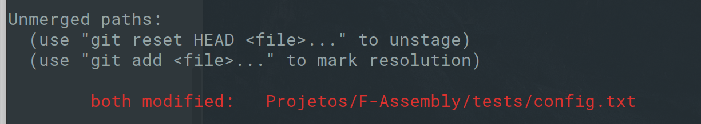

# Simulado avaliação prática 3 - Elementos de Sistemas

Esse é um simulado da prova prática 3 de Elementos de Sistemas. 

Você deve ser capaz de realizar essa avaliação sem consultar a internet, 
somente seu repositório local.

- Você deve editar o arquivo `ALUNO.json` com o seu nome e e-mail

## Começando 

1. Crie um repositório no seu github com o nome: `P3-Elementos`
1. Clone o repositório para a sua máquina, exemplo:

``` bash
$ git clone https://github.com/rafaelcorsi/P3-Elementos
```

1. Adicione um `upstream` que aponta para o repositório do grupo:

``` bash
$ git remote add upstream  https://github.com/lucaslealvale/Z01.1-macarrao
```

1. Baixe os arquivos:

``` bash
$ git fetch upstream
$ git merge upstream/master
```

3. Você deve aplicar o `patch.diff` ao repositório clonado

   - Dentro da pasta do repositório **recém clonado**, execute o comando:
   
   ```bash
   $ wget https://raw.githubusercontent.com/Insper/P3-Elementos-De-Sistemas/master/patch.diff
   $ git apply -3 --ignore-space-change --ignore-whitespace patch.diff
   ```
    
Esse patch altera o seu repositório da seguinte maneira:

``` diff
+new file:   Avaliacao/Prova-3.odt
+new file:   Avaliacao/Prova-3.pdf
+new file:   Projetos/F-Assembly/src/nasm/p3Pseudo.nasm
+new file:   Projetos/F-Assembly/src/nasm/p3TesteLed.nasm
+new file:   Projetos/F-Assembly/src/nasm/p3VectorMax.nasm
+new file:   Projetos/F-Assembly/tests/tst/p3Pseudo/p3Pseudo0_in.mif
+new file:   Projetos/F-Assembly/tests/tst/p3Pseudo/p3Pseudo0_tst.mif
+new file:   Projetos/F-Assembly/tests/tst/p3Pseudo/p3Pseudo1_in.mif
+new file:   Projetos/F-Assembly/tests/tst/p3Pseudo/p3Pseudo1_tst.mif
+new file:   Projetos/F-Assembly/tests/tst/p3TesteLed/p3TesteLed0_in.mif
+new file:   Projetos/F-Assembly/tests/tst/p3TesteLed/p3TesteLed0_tst.mif
+new file:   Projetos/F-Assembly/tests/tst/p3VectorMax/p3VectorMax0_in.mif
+new file:   Projetos/F-Assembly/tests/tst/p3VectorMax/p3VectorMax0_tst.mif
+new file:   Projetos/F-Assembly/tests/tst/p3VectorMax/p3VectorMax1_in.mif
+new file:   Projetos/F-Assembly/tests/tst/p3VectorMax/p3VectorMax1_tst.mif
+modified:   Projetos/F-Assembly/tests/config.txt
+modified:   Projetos/G-Computador/tests/vhd/tb_ControlUnit.vhd
```

   - **Verifique os arquivos** alterados analisando se existe algum problema de `merge`:
   
   ```bash
   $ git status
   $ #ou
   $ git diff --check
   ```
   
Caso tenha um problema de merge, a seguinte informação deve aparecer:


   
   - Se sim, corrija o problema.
   - e então adicione todos os novos arquivos e **envie ao servidor**:
   
   ```bash
   $ git add *
   $ git commit -am "Avaliacao 3"
   $ git push origin master
   ```
   
4. Você deve editar o arquivo: `Avaliacao/ALUNO.json` com os seus dados

5. A descrição da avaliação está no documento 
`Avaliacao/Prova-3.pdf`


**Boa prova**
